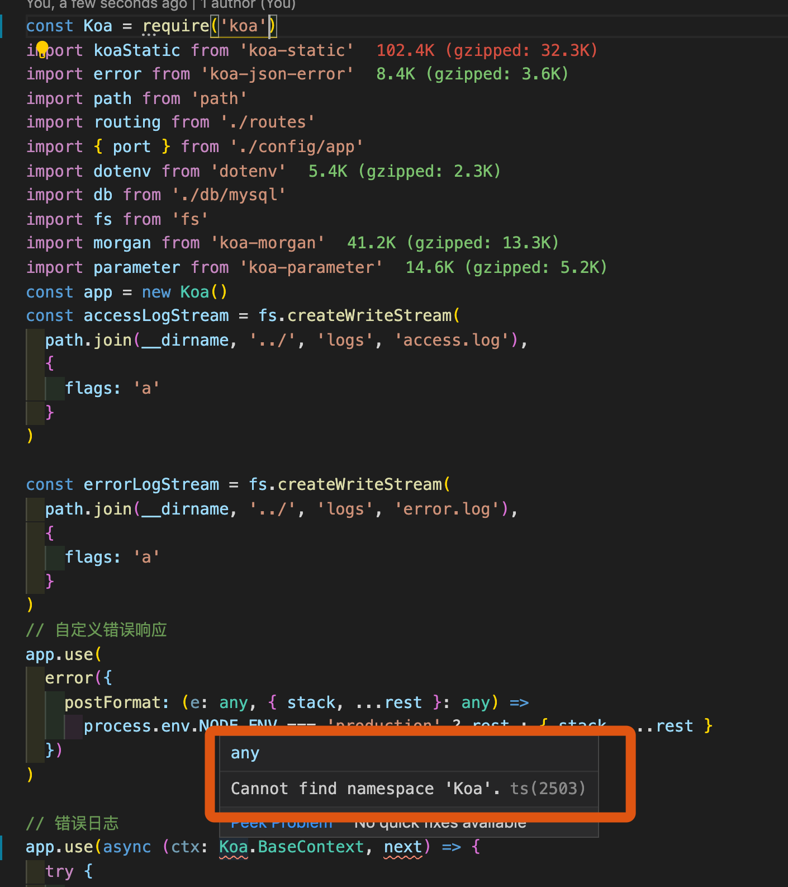

# ❗️❗️@types:就是声明文件的意思  --- 要清楚概念啊！！！
>  https://jack-cool.github.io/2019/08/05/tsconfig-json-%E9%85%8D%E7%BD%AE%E8%AF%A6%E8%A7%A3/


当运行`yarn run build` 我们可以在buid文件夹下看到types文件夹没了

这就是编译的效果  但是我们的node_module需要忽略掉


默认情况下 ts是不会去编译node_modules下的


## 显示的去编译node_modules下的
```JSON
{
  "compilerOptions": {
   // "strict": true,
    "module": "commonjs",
    "target": "ESNext",
    "noImplicitAny": true,
    // 按需引入 -- 最终.d.ts会被编译消失
    // "typeRoots": ["./app/types"],
    "moduleResolution": "node",
    "sourceMap": false,
    "esModuleInterop": true,
    "experimentalDecorators":true,
    "forceConsistentCasingInFileNames":true,
    "outDir": "build",
    "baseUrl": "./"
  },
  // 编译只经过app下的
  "include": ["./app/**/*","node_modules/"],
  // "exclude": ["node_modules", "./__tests__/*"]

}

```

`编辑器也会识别tsconfig` 去读 tsconfig

ts 文件--->编译成 js


就算是js文件 ts也会去编译  编译成 "target": "ESNext",

但是我很好奇 为什么前端需要`编译node`


# 前端编译和后端编译的区别

后端：node是运行不了ts文件 所以我们需要编译成js,但是前端不需要打包构建，我引入的库不用打包，还是继续使用，只要启动应用就行

前端：前端不一样了，前端最后打包出来的就是静态文件，你要知道，所以所需要的代码，所需要的包都直接打包构建，这就是区别，
所以后端根本不需要编译node_modules下的包,实际上后端也可以像前端用webpack那样打包构建，可是没必要，因为我直接用nodejs就行


打包构建是webpack来弄的


# 区分好编译和@types

- 首先include包含的话 ts是会去编译这个包的
- 但是typeRoots和type是决定@types要不要引入到全局,也就是引入全局我们可以直接在全局使用？


控制全局
可以看出，对于某些团队而言，拥有允许全局泄漏的定义可能是一个问题。
因此，你可以通过配置 tsconfig.json 的 compilerOptions.types 选项，引入有意义的类型：

```javascript
{
  "compilerOptions": {
    "types" : [
      "jquery"
    ]
  }
}
```

如上例所示，通过配置 compilerOptions.types: [ "jquery" ] 后，
只允许使用 jquery 的 @types 包，即使这个人安装了另一个声明文件
，比如 npm install @types/node，它的全局变量（例如 process）
也不会泄漏到你的代码中，直到你将它们添加到 tsconfig.json 类型选项。


熟悉 Typescript 配置选项是 TS 项目开发的最基本要求。
TS 使用 tsconfig.json 作为其配置文件，它主要包含两块内容：

// 对 分析的没错
- 指定待编译的文件
- 定义编译选项

另外，一般来说，tsconfig.json 文件所处的路径就是当前 TS 项目的根路径。


只会引入 node 、 lodash 和 express 三个声明模块，其它的声明模块则不会被自动引入。
如果 types 被设置为 [] ，那么将不会自动引入任何声明模块。此时，如果想使用声明模块，只能在代码中手动引入了




原来 typeRoots和types作用

如果没有声明typeRoots 我们node_modules有多少个@types都会`自动引入到全局 `但是有时候没用的包我们肯定不需要引入到全局类型

注意可以认为我们的类型.d.ts都是全局，编辑器都可以识别  不过都有自己的namespace 比如Koa.xxx mysql.xxx

我们这时候想做限制

只有`import`的时候才会引入到全局想想为啥用import不用`require`的原因了,用require是引入不了的

指定"types": []来禁用自动引入@types包。

# types
如果指定了 types， 只有被列出来的包才会被包含进来。eg：

```javascript
{
         "compilerOptions": {
            "types": ["node", "lodash", "express"]
         }
      }
```
这个 tsconfig.json 文件将仅会包含 ./node_modules/@types/node，./node_modules/@types/lodash和./node_modules/@types/express。

/@types/。 node_modules/@types/*里面的其它包不会被引入进来。

c. 注意，`自动引入包是你在全局声明时引入的`。`如果你使用了 import "foo" 语句，`
`ts 仍然会查找 node_modules 和 node_modules/@types 文件夹来获取 foo 包`


### @types, typeRoots 和 types（这三项属于compilerOptions 顶级配置下的配置属性）

>  -- 其实注意下@types, typeRoots 和 types这个标题就知道 typeRoots 和 types跟@types 有关 ，而且命名啊！！！！

- ❗️❗️@types:就是声明文件的意思

所以typeRoots跟types跟编译毫无联系，跟@types引入（声明）有关系


```javascript
{
  "compilerOptions": {
    "strict": true,
    "module": "commonjs",
    "target": "ESNext",
    "noImplicitAny": true,
    // "typeRoots": [], typeRoots用来指定声明文件或文件夹的路径列表，如果指定了此项，则只有在这里列出的声明文件才会被加载
    "typeRoots": ["./app/types"],
    "moduleResolution": "node",
    // 原来是加载声明文件,但是include:['node_modules']会编译node_modules下的包
     "types":["node"],  //  types用来指定需要包含的模块，只有在这里列出的模块的`声明文件`才会被加载进来 
    "sourceMap": false,
    "esModuleInterop": true,
    "experimentalDecorators":true,
    "forceConsistentCasingInFileNames":true,
    "strictPropertyInitialization":false,
    "outDir": "build",
    "baseUrl": "./"
  },
  // 编译只经过app下的
  "include": ["./app/**/*"],
  "exclude": ["node_modules", "./__tests__/*"]

}
```